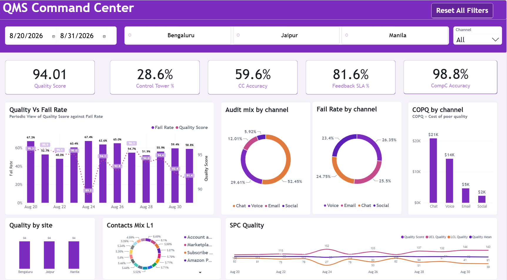
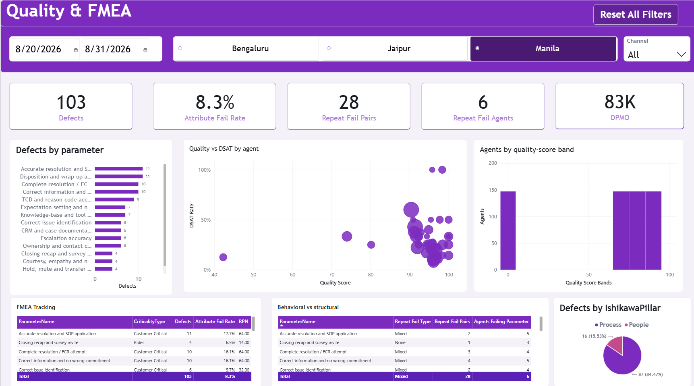
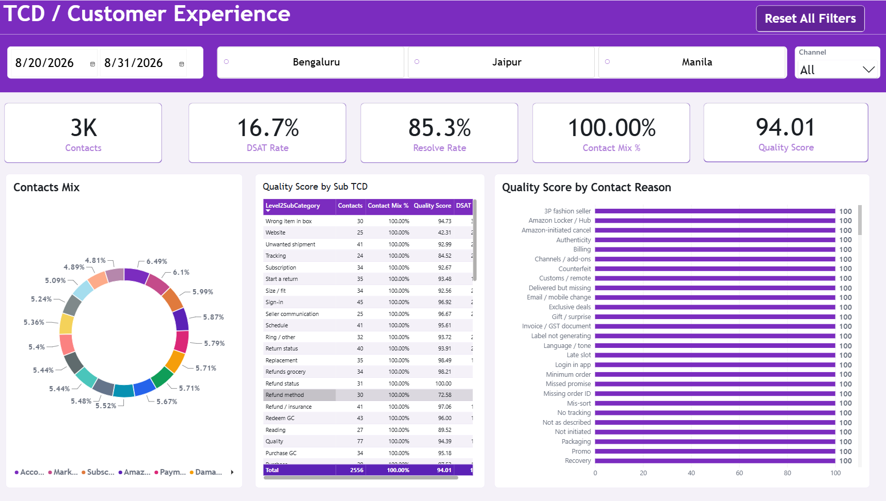
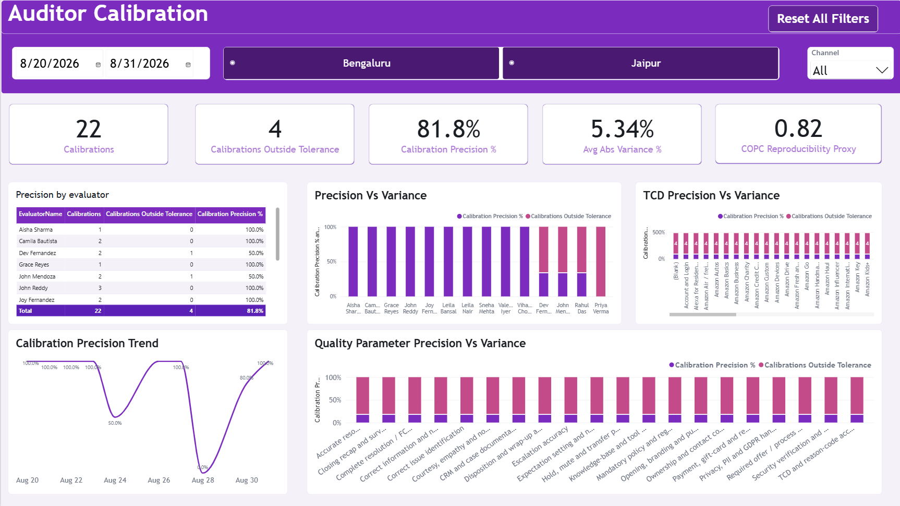
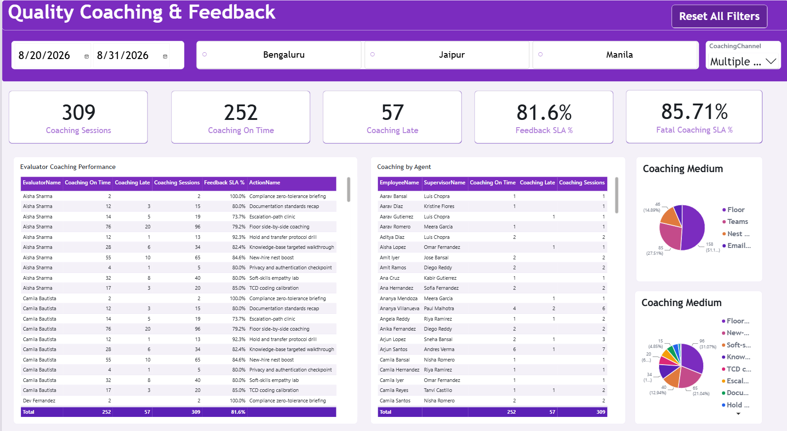

# Enterprise Quality Management (EQM) Command Center

## Executive Summary
The EQM Command Center is a robust, enterprise-grade Power BI analytical solution engineered to evaluate operational quality, agent coaching effectiveness, and customer experience outcomes. By unifying CRM interaction data, quality evaluations, and financial impact metrics, this dashboard elevates quality assurance from reactive scoring to proactive statistical process control.  

https://github.com/user-attachments/assets/657d6a72-0640-4822-a8f8-2ba65b0ecaf3

## Tech Stack & Core Competencies Showcase
* **Platform:** Power BI Desktop, Power BI Service.  
* **Data Engineering:** Power Query (M), ETL unpivoting, Dimensional Modeling.  
* **Analytical Frameworks:** Lean Six Sigma (LSSGB), Statistical Process Control (SPC), Failure Mode and Effects Analysis (FMEA).  
* **Advanced DAX:** Predictive Linear Regression (`LINESTX`), custom Iterators, Parent-Child Hierarchies (`PATH`), and custom statistical algorithms.

---

## Business Problem & Objective
Enterprise operations frequently struggle to bridge the gap between internal quality metrics and actual customer satisfaction (CSAT) or financial impact. Furthermore, isolating systemic process instability from isolated behavioral errors requires extensive manual analysis.  

**This dashboard solves this by:**
* **Translating Defects to Dollars:** Quantifying the direct financial impact of defects using Cost of Poor Quality (COPQ) metrics, mapped via internal and external rate structures.  
* **Implementing Statistical Process Control (SPC):** Moving beyond simple averages to track process variance, Upper/Lower Control Limits (UCL/LCL), and Nelson Rules for anomaly detection natively in DAX.  
* **Automating Risk Prioritization:** Embedding FMEA principles to automatically generate Risk Priority Numbers (RPN) for specific QA parameters based on Occurrence, Severity, and Detection.  

---

## Core Analytical Modules & Dashboard Views

### 1. Quality & FMEA (Failure Mode and Effects Analysis)
Tracks defect rates against CSAT and utilizes automated Risk Priority Number (RPN) scoring to identify high-impact failure modes.

### 2. TCD / Customer Experience
Monitors contact mix, DSAT (Dissatisfaction) rates, and resolution effectiveness across various contact reasons and channels.

*(Alternate View)*

### 3. Auditor Calibration
Measures evaluator alignment against a standard "Gauge," identifying scoring variances, outside-tolerance rates, and overall precision to ensure audit fairness.

### 4. Quality Coaching & Feedback
Tracks post-evaluation coaching sessions, focusing on SLA adherence, feedback lag hours, and fatal error coaching compliance.

### 5. QA Audit Raw Data
Provides granular, unpivoted line-item defect data utilized for precise DPMO (Defects Per Million Opportunities) and Yield calculations.

---

## Data Dictionary & Schema Architecture
The solution employs a highly scalable Star Schema architecture optimized for DAX performance and large-scale data.  

| Table Name | Type | Description |
| :--- | :--- | :--- |
| **`Fact_CRM_Contact`** | Fact | Logs customer interaction metrics, handle times, CSAT, and repeat contact flags. |
| **`Fact_QA_Evaluation`** | Fact | Stores header-level evaluation metadata (e.g., evaluator ID, evaluation type, total score). |
| **`Fact_QA_Evaluation_Line`** | Fact | Unpivoted, granular line-item defect data utilized for precise DPMO and Yield calculations. |
| **`Fact_Coaching`** | Fact | Tracks post-evaluation coaching sessions, focusing on SLA adherence and feedback lag hours. |
| **`Fact_Calibration`** | Fact | Measures evaluator alignment against a "Gauge" to identify scoring variances and precision. |
| **`Dim_Employee`** | Dimension | Manages the organizational hierarchy and tracks agent tenure milestones (e.g., nesting days). |
| **`Dim_QA_Parameter`** | Dimension | Classifies QA attributes by criticality, FMEA Detection/Severity factors, and Ishikawa pillars. |
| **`Dim_COPQ_Rate`** | Dimension | Houses internal and external defect cost values mapped to specific failure classes. |
